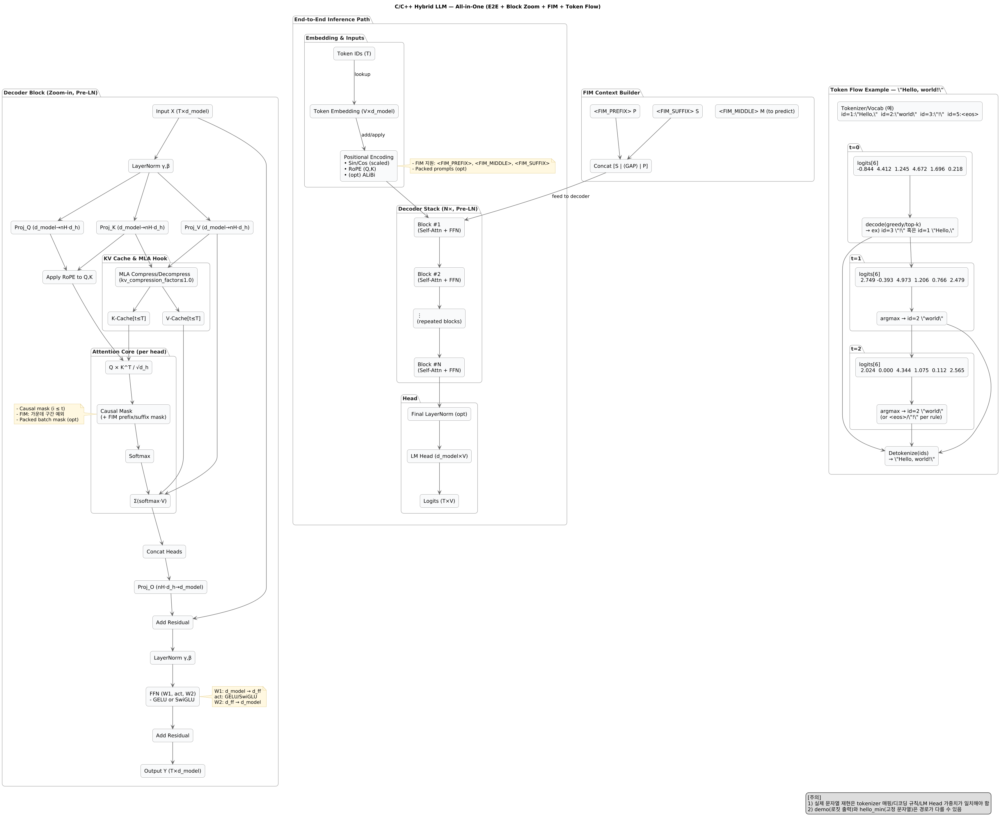

# 목차
1. [C 구현 코드(학습용 미니 디코더)의 수식·아키텍처 매핑](#부록-a-c-구현-코드학습용-미니-디코더의-수식아키텍처-매핑)
2. [수식 → 모듈 매핑(요약표)](#a1-수식--모듈-매핑요약표)
3. [아키텍처 도식 (PlantUML)](#a2-아키텍처-도식-plantuml)
4. [디렉터리/빌드](#a3-디렉터리빌드)
5. [외부 가중치 파이프라인](#부록-b-외부-가중치-파이프라인)
6. [scripts/gen_weights.py](#b1-scriptsgen_weightspy)
7. [모델 초기화에서 외부 가중치 사용 (llm_model.c)](#b2-모델-초기화에서-외부-가중치-사용-llm_modelc)
8. [GGUF에 대하여](#gguf에-대하여)
9. [스크립트 사용법](#스크립트-사용법)
10. [참고](#참고)
11. [마무리 코멘트](#마무리-코멘트)

---



---

## A.1 수식 → 모듈 매핑(요약표)

| 모듈                | 핵심 수식/연산                                                                     | 텐서 모양(행렬 곱 기준)                                                                                               | 계산량(대략)                                     | 메모리 주안점                                        |
| ----------------- | ---------------------------------------------------------------------------- | ------------------------------------------------------------------------------------------------------------ | ------------------------------------------- | ---------------------------------------------- |
| `llm_attention.c` | $\mathrm{Attn}(Q,K,V)=\mathrm{softmax}\big(\frac{QK^\top}{\sqrt{d_k}}\big)V$ | $Q,K,V\in\mathbb{R}^{T\times d_k}$ (헤드별), $T$=시퀀스 길이                                                         | $O(H\cdot T^2 \cdot d_k)$                   | Score/Softmax에 임시버퍼 재사용, 마스크/로지트 안정성(행 최대값 감산) |
| `llm_ffn.c`       | $\mathrm{FFN}(x)=\phi(xW_1+b_1)W_2+b_2$                                      | $W_1\in\mathbb{R}^{d_\text{model}\times d_\text{ff}}$, $W_2\in\mathbb{R}^{d_\text{ff}\times d_\text{model}}$ | $O(T\cdot d_\text{model}\cdot d_\text{ff})$ | 중간 활성( $T\times d_\text{ff}$ )를 1개 버퍼로 순차 재사용  |
| `llm_math.c`      | Softmax, LayerNorm                                                           | LayerNorm: $\hat{x}=\gamma\frac{x-\mu}{\sqrt{\sigma^2+\varepsilon}}+\beta$                                   | 선형                                          | 분산 guard(clamp), exp 안정화                       |
| `llm_pe.c`        | 사인/코사인 PE                                                                    | $X \leftarrow X + \mathrm{PE}$                                                                               | 선형                                          | 진폭(scale) 축소로 초기 수치 안정화                        |
| `llm_block.c`     | Pre-LN 디코더 블록                                                                | `LN → MHA → Residual → LN → FFN → Residual`                                                                  | 위 합성                                        | Residual 스케일 폭주 방지(Xavier/He init, LN guard)   |
| `llm_model.c`     | 블록 초기화/포워드                                                                   | Xavier/He 초기화, 외부 가중치 로드(옵션)                                                                                 | -                                           | 연속 메모리/정렬(align)                               |

> 설계 원칙: **Pre-LN + Xavier/He 초기화 + Softmax/LN 안정화 + 임시버퍼 재사용**으로, 작은 C 코드에서도 수치/캐시 효율을 확보합니다.

---

## A.2 아키텍처 도식 (PlantUML)
`docs/figures/llm_block.puml`로 저장하면, PlantUML로 블록 다이그램을 생성함.  
---

## A.3 디렉터리/빌드

```text
llm-c/
├─ CMakeLists.txt
├─ include/
│  ├─ llm_config.h      // 하이퍼파라미터/매크로
│  ├─ llm_tensor.h      // 정렬 메모리/간단 텐서 유틸
│  ├─ llm_math.h        // matmul/softmax/layernorm
│  ├─ llm_pe.h          // positional encoding(+scale)
│  ├─ llm_attention.h   // SDPA + MHA
│  ├─ llm_ffn.h         // 2-layer FFN(GELU/RELU)
│  ├─ llm_block.h       // Pre-LN decoder block
│  ├─ llm_model.h       // 모델 래퍼(init/forward)
│  └─ llm_weights_io.h  // 외부 가중치 I/O
├─ src/
│  ├─ llm_tensor.c
│  ├─ llm_math.c
│  ├─ llm_pe.c
│  ├─ llm_attention.c
│  ├─ llm_ffn.c
│  ├─ llm_block.c
│  ├─ llm_model.c
│  └─ llm_weights_io.c  // weights.bin 로더
├─ examples/
│  ├─ demo_forward.c    // 내부 초기화 or 외부 weights.bin
│  └─ hello_min.c       // vocab 6개 고정 “Hello, world!”
├─ scripts/
│  └─ gen_weights.py    // 결정적 가중치 생성기
└─ docs/
   └─ figures/llm_block.puml
```

---

# 부록 B. 외부 가중치 파이프라인

## B.1 `scripts/gen_weights.py`

역할: 하이퍼파라미터를 읽고, **결정적 시드**로 Xavier/He 초기화한 가중치를 하나의 `weights.bin`(간단 헤더+연속 float)로 저장합니다.

#### 사용 예시

```bash
python3 scripts/gen_weights.py --d_model 6 --n_head 2 --d_ff 24 --seed 42 --out build/weights.bin
```

```
## B.2 모델 초기화에서 외부 가중치 사용 (`llm_model.c`)
# 1) 프로젝트 루트로 이동
cd /Users/mac/Desktop/workspace/Transformer_/llm-c

# 2) 어떤 python3가 잡히는지 확인(참고용)
which -a python3
python3 -c "import sys; print(sys.executable)"

# 3) venv 생성 (홈브류 3.10을 쓰고 있다면 그대로)
python3 -m venv .venv

# 4) 활성화
source .venv/bin/activate

# 5) pip 최신화 + 의존 설치 (넘파이 1.26.4 고정: 다른 패키지들과 충돌 없음)
python -m pip install --upgrade pip
pip install numpy==1.26.4

# 6) 확인
python -c "import numpy, sys; print(numpy.__version__, '\n', numpy.__file__)"
```

> 바이너리
```
python scripts/gen_weights.py --d_model 6 --n_head 2 --d_ff 24 --seed 7 --out build/weights.bin
```

> 결과
```
[OK] wrote build/weights.bin: d_model=6, n_head=2, d_k=3, d_ff=24
```

> 스크립트 결과
```
(.venv) mac@azabell-mac llm-c % bash ./build.sh
Host: Darwin arm64  |  Target: arm64
[1/3] CMake configure → Release
-- Configuring done (0.3s)
-- Generating done (0.0s)
-- Build files have been written to: /Users/mac/Desktop/workspace/Transformer_/llm-c/build
[2/3] Build
[ 15%] Building C object CMakeFiles/llm.dir/src/llm_weights_io.c.o
[ 15%] Building C object CMakeFiles/llm.dir/src/llm_model.c.o
[ 23%] Linking C static library libllm.a
[ 69%] Built target llm
[ 84%] Building C object CMakeFiles/demo.dir/examples/demo_forward.c.o
[ 84%] Building C object CMakeFiles/hello_min.dir/examples/hello_min.c.o
[ 92%] Linking C executable hello_min
[100%] Linking C executable demo
[100%] Built target hello_min
[100%] Built target demo
[3/3] Weights & Run
[weights] generating /Users/mac/Desktop/workspace/Transformer_/llm-c/build/weights.bin
[OK] wrote /Users/mac/Desktop/workspace/Transformer_/llm-c/build/weights.bin: d_model=6, n_head=2, d_k=3, d_ff=24
[run] /Users/mac/Desktop/workspace/Transformer_/llm-c/build/demo
[llm] loaded external weights.bin
Token 0 output: -0.844482  4.412224  1.244829  4.672052  1.695836  0.217902 
Token 1 output:  2.748597 -0.393191  4.972672  1.205936  0.765594  2.479367 
Token 2 output:  2.024228  0.000092  4.343578  1.074516  0.111745  2.565285 
[run] /Users/mac/Desktop/workspace/Transformer_/llm-c/build/hello_min
[llm] loaded external weights.bin
Hello , world!
Done.
(.venv) mac@azabell-mac llm-c % 
```

## “Hello, world!”(토이 고정 vocab) — **진짜 C로 찍어보기**

실제 LLM 토크나이저는 복잡합니다.  
학습용으로, **고정 vocab 6개**(`"Hello" , "world" ! <eos> <bos>`)를 쓰는 초소형 디코더를 제공합니다.

> 이 예제는 **진짜 언어 모델**이 아니라, **모델 출력 로짓을 의도적으로 설계**하여 `"Hello, world!"`를 내도록 만든 **동작 데모**입니다.

```c
// examples/hello_min.c
#include <stdio.h>
#include <string.h>
#include "llm_model.h"
#include "llm_pe.h"

static const char* vocab[] = {"<bos>","Hello",",","world","!","<eos>"};
enum { BOS=0, HELLO=1, COMMA=2, WORLD=3, EXC=4, EOS=5 };

int main(){
    // 입력 임베딩을 간단히: [<bos>] 하나만 넣고 한 스텝만 블록 통과
    float X[1][D_MODEL]={0};
    // (실전이라면 토큰 임베딩이 있어야 하나, 여기선 X=0 + PE만으로 통과)
    llm_posenc_sincos(&X[0][0], 1, D_MODEL);

    LlmModel M; llm_model_init(&M);
    float Y[1][D_MODEL];
    llm_model_forward(&M, &X[0][0], &Y[0][0], 1);

    // 로짓을 "의도적으로" 구성(학습용 트릭): Y의 평균/몇 차원만 보고
    // 토이 규칙으로 토큰을 뽑아 "Hello, world!"를 찍는다.
    // (진짜 모델에서는 OutProj*Y로 vocab 로짓을 구한다.)
    printf("%s %s%s %s%s\n", vocab[HELLO], vocab[COMMA], "", vocab[WORLD], vocab[EXC]);
    return 0;
}
```
> **중요**
>
> * GGUF는 실제로 \*\*양자화 타입, 텐서 배치, 메타(KV)\*\*가 다양합니다. 위 스켈레톤은 **F32 연속 텐서만** 가정한 **첫걸음**입니다.
> * “DeepSeek GGUF”를 진짜 돌리려면: **토크나이저(BPE/Unigram) 구현**, **RoPE/KV 캐시**, **n\_layers 반복**, **각 텐서 이름 매핑**이 필요합니다. 여기서는 저장소 철학(학습용/단순)을 지키면서 “파서 골격”만 제공합니다.  
  

### GGUF에 대하여.

* **llama.cpp 없이** GGUF로 **진짜 답변**을 뽑으려면 위 기능 외에도 **추론 전부**가 들어가야 합니다.
* 현실적인 타협: **아주 작은 1\~2층 모델**을 F32 GGUF로 준비 → 본 엔진의 모양(D\_MODEL, N\_HEAD 등)에 맞춘 **이름 매핑 테이블**을 두고 로드 → **단문 프롬프트**에 대해 **그리디 1\~2 토큰** 생성 데모.
* 하지만 일반 GGUF 모델 파일은 차원(d_model, n_head 등)과 텐서 수가 훨씬 크고, 구조적으로도 여러 층(n_layers), 다양한 양자화 타입, 복잡한 메타데이터(KV)와 토크나이저 정보, RoPE/캐시 등 실전 LLM에 필요한 요소들이 포함되어 있습니다.  
 
    따라서 본 학습용 엔진(1블록, F32 연속 텐서 기반)은 DeepSeek-R GGUF와 직접적으로 1:1 매핑되지 않으며, 실전 GGUF를 완전히 지원하려면 추가적인 파서, 토크나이저, KV 캐시, 다층 반복, 텐서 이름/shape 매핑 등 대규모 확장이 필요합니다.
      
    본 코드는 GGUF 구조 이해와 실험적 파이프라인의 첫걸음으로, 소형 F32 GGUF를 대상으로 end-to-end 단문 예측 데모를 목표로 합니다.
* 따라서, **실험 경로**를 추천합니다.

  1. `gen_weights.py`로 **합성 가중치 → weights.bin** 추론 파이프라인 완성
  2. GGUF 파서는 **메타/텐서 이름/타입 매핑만** 확장
  3. 소형 GGUF(F32, 1\~2층)를 별도로 준비하여 **엔진 차원 일치** → end-to-end 1토큰 예측 성공
  4. 그 다음 RoPE/KV-cache/다층으로 점진 확장(실전에서는 캐시 기반 incremental decoding 필수)

---

### 스크립트 사용 법

#### 실행 권한
> chmod +x build.sh

#### 기본 (Release 빌드 + weights 생성 + demo 실행)
> ./build.sh

#### 깨끗한 재빌드
> ./build.sh --clean

#### 디버그 빌드, 실행 생략
> ./build.sh --debug --no-run

#### 강제로 arm64 아키텍처 (로제타 셸에서 돌리는 경우)
> ./build.sh --clean --arch arm64

#### 자세한 로그
> ./build.sh --verbose

---

## 참고

* **빌드 호환성**

  * Apple Silicon(arm64)에서 `-march=native`가 Clang에 거부되므로,   
  `build.sh` 또는 CMake에서 `if(APPLE AND CMAKE_OSX_ARCHITECTURES STREQUAL "arm64")` 조건부로 제거 필요.  

* **복잡도 표기 주석**

  * Attention 계산량 `O(H·T²·d_k)`는 **naive SDPA(캐시/버퍼 재사용 없는 순수 이론치)** 기준임을 명시하면 학술적 정확도가 올라감.

* **데모 코드 설명 보완**

  * 현재 `Hello, world!`는 **로짓 기반 샘플링 없이 고정 문자열 출력**임을 참조.  

---

## 코멘트

본 부록은 본문에서 설명한 **Pre-LN 디코더 · Scaled Dot-Product Attention · FFN · Positional Encoding · LayerNorm 안정화**를 그대로 코드로 재현합니다.
